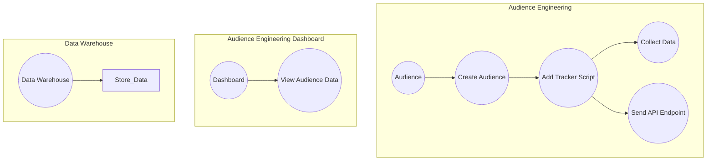

This is experimental marketing engineering tool which marketers can use to improve their understanding of customers and optimize their marketing strategies.

Here are a few examples:.

- **Cohort analysis:** This technique involves grouping customers based on shared characteristics and tracking their behavior over time. Cohort analysis can be used to identify trends and patterns that might not be apparent when looking at customer behavior as a whole.

- **Predictive modeling:** This involves using statistical models to make predictions about customer behavior or outcomes. For example, predictive models might be used to forecast customer churn, identify high-value customers, or recommend products to customers based on their purchase history.

- **A/B testing:** This involves testing different variations of marketing campaigns, websites, or other marketing materials to see which version performs better. A/B testing can be used to optimize everything from email subject lines to landing pages.

- **Customer segmentation:** This involves dividing customers into different groups based on shared characteristics or behaviors. Customer segmentation can be used to tailor marketing messages to specific groups, or to identify new market opportunities.

- **Personalization:** This involves using customer data to personalize marketing messages, product recommendations, or other aspects of the customer experience. Personalization can help improve customer engagement and loyalty.

- **Attribution modeling:** This involves identifying which marketing channels or touchpoints are most effective at driving conversions or other desired outcomes. Attribution modeling can be used to optimize marketing spend and better understand the customer journey.

## Diagram

